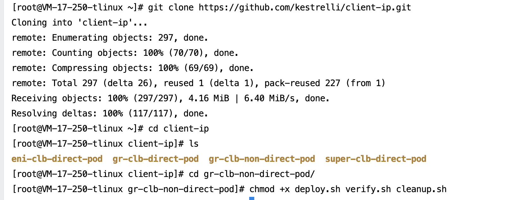

[English](README.md) | [中文](README_zh.md)

## 📌  **Overview**​

This solution leverages Tencent Cloud TKE's ​**GlobalRouter network mode**​ with Ingress Controller to enable Layer 7 load balancing while preserving the client's real source IP. Ideal for business scenarios requiring source IP extraction from HTTP headers (e.g., web applications, API gateways).

>**Core Value**: Resolves source IP loss in non-direct mode by passing real client IP through `X-Forwarded-For`header

**Automation Workflow**:
- `deploy.sh`: One-click application and Service deployment
- `verify.sh`: One-click client source IP validation
- `cleanup.sh`: One-click resource cleanup

----

## 业务访问链路流程图

```mermaid
graph LR    
    A[Client] -->|HTTP/HTTPS Request| B{Traffic Entry}
    B --> C[LB-Type Service]
    B --> D[LB-Type Ingress]
    C -->|Non-Direct Mode| E[NodePort]
    D -->|Non-Direct Mode| E[NodePort]
    E --> F[Business Pod]
    subgraph TKE Cluster
        F[GlobalRouter Network<br>Business Pod]
    end
    A <--> |Response Data| F
    style A fill:#4CAF50,color:white
    style B fill:#2196F3,color:white
    style C fill:#FF9800,color:black
    style D fill:#FF9800,color:black
    style E fill:#7136F5,color:white
    style F fill:#9C27B0,color:white
```

##  🛠 Prerequisites

### 1. Cluster Requirements

- Network mode: GlobalRouter
- Kubernetes version: ≥ 1.18
- Ingress enabled

### 2. Required Tools
- kubectl (v1.18+)
- curl

### 3.  Account Requirements  
- CLB service activated   
- Obtain cluster credentials:[Connecting to Clusters](https://cloud.tencent.com/document/product/457/39814)

### 4. Test Images

- ​**Default Image**: `test-angel01.tencentcloudcr.com/kestrelli/kestrel-seven-real-ip:v1.0`
- ​**Custom Image**: Modify address in `deploy.sh`


## 🚀 Quick Start
###  Step 1: Deploy Application

```
# Clone project
git clone https://github.com/kestrelli/client-ip.git 
cd client-ip/gr-clb-non-direct-pod

# Grant execution permissions
chmod +x deploy.sh verify.sh cleanup.sh 

# One-click deployment
./deploy.sh  
```
Deployment completes in ~1 minute, automatically creating:
- Namespace
- Business Deployment
- NodePort Service
- Ingress routing
- Ingress public IP




###  Step 2: Verify Source IP

```
# Run verification
./verify.sh

# Expected Output:
Verification Result:
X-Forwarded-For: 106.55.163.108 
```


###  Step 3: Cleanup Resources

```
# Run cleanup
./cleanup.sh
```


##  ✅ Verification Checklist

|​**Item**​|​**SuccessCriteria**​|​**CheckCommand**​|
|:-:|:-:|:-:|
|​**Deployment Status**​|All resources created successfully|`kubectl get all -n kestrelli-catchip`|
|​**Ingress Status**​|Ingress has public IP|`kubectl get ingress -n kestrelli-catchip`|
|​**Source IP Validation**​|Returns X-Forwarded-For header|`./verify.sh`|

### ​**Custom Test Image**​
```
# Modify image in deploy.sh
sed -i 's|test-angel01.tencentcloudcr.com|your-registry.com|g' deploy.sh 
```
##  📦 Project Structure
```
gr-clb-non-direct-pod/  
├── deploy.sh        # Deployment script  
├── verify.sh        # Verification script  
├── cleanup.sh       # Cleanup script  
└── README.md        # Documentation   
```
