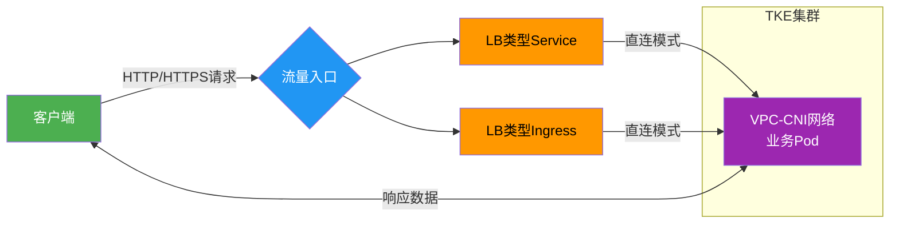

## 📌 概述

本方案通过腾讯云TKE的**VPC-CNI网络模式**实现CLB直接访问业务Pod，彻底绕过NodePort转发层，确保业务应用获取100%真实的客户端源IP。使用本方案可：
- 解决传统NodePort模式源IP丢失问题
- 满足金融、电商等场景的安全审计需求

>​**核心价值**​：通过三个脚本实现全流程自动化管理，部署到验证仅需几分钟

## 详细业务访问链路流程图​




## 🛠️ 前提条件

### 1. 环境准备

##### 1.1 TKE集群要求  
- 网络模式：VPC-CNI  
- Kubernetes版本：≥ 1.20  

###### 1.2 本地工具  
- 安装kubectl（执行下方命令）：  
  curl -LO https://dl.k8s.io/release/v1.25.0/bin/linux/amd64/kubectl  
  chmod +x kubectl && sudo mv kubectl /usr/local/bin/  

##### 1.3 集群凭证  
- 请将集群API sever中的 kubeconfig 文件内容保存到 ~/.kube/config（或替换原有文件），然后直接运行 kubectl get nodes命令，如果看到节点列表就说明可访问集群。

### 2. 业务镜像

- ​**默认镜像**​：`vickytan-demo.tencentcloudcr.com/kestrelli/images:v1.0`
- ​**自定义镜像**​：需修改`deploy.sh`中的镜像地址

## 🚀 快速开始

### 步骤1：部署应用
```
# 获取项目代码
git clone git clone https://github.com/kestrelli/client-ip.git 
cd client-ip
cd eni-clb-direct-pod
# 授予执行权限
chmod +x deploy.sh verify.sh cleanup.sh 
# 一键部署
./deploy.sh  
```
部署过程约1分钟，自动完成：
- 创建业务负载(Deployment)
- 配置直连Service
- 获取CLB公网IP
