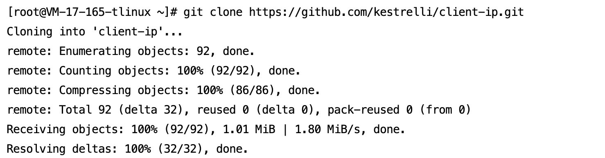

## 概述

本方案通过腾讯云TKE的**GlobalRouter网络模式**实现CLB直连Pod，绕过NodePort转发层，直接获取客户端真实源IP。适用于：
- 需要精准客户端IP的审计系统
- 基于IP的访问控制策略
- 实时风控和日志分析场景

>​**核心价值**​：解决传统NodePort模式源IP丢失问题

## 前提条件

1. ​**TKE集群**​
	- Kubernetes版本 ≥ 1.20
	- 网络模式 = GlobalRouter
2. ​**本地环境**​

```
# 安装kubectl (已安装可跳过)
curl -LO "https://dl.k8s.io/release/$(curl -L -s https://dl.k8s.io/release/stable.txt)/bin/linux/amd64/kubectl"
chmod +x kubectl && sudo mv kubectl /usr/local/bin/
```
3.​**集群凭证**

[连接集群](https://cloud.tencent.com/document/product/457/39814)

## 快速开始

### 步骤1：部署应用

```
# 1. 下载项目
git clone https://github.com/kestrelli/client-ip.git
cd client-ip
cd gr-clb-direct-pod
# 2. 授权执行权限
chmod +x *.sh
# 3. 一键部署
./deploy.sh
```


部署过程约1分钟，自动完成：
- 启用GlobalRoute直连模式
- 创建业务负载(Deployment)
- 配置直连Service
- 获取CLB公网IP

### 步骤2：验证源IP

```
# 运行验证脚本
./verify.sh

# 预期输出：
验证结果：
{"remote_addr":"106.55.163.108"} 
客户端真实IP显示在 remote_addr 字段
```

### 步骤3：清理资源
```
# 一键清理（删除Service/Deployment并关闭直连模式）
./cleanup.sh
```

## 关键配置说明

### 部署脚本核心逻辑（deploy.sh）
```
# 一键部署脚本 (deploy.sh)
#!/bin/bash
# 启用直连能力
kubectl patch cm tke-service-controller-config -n kube-system --patch '{"data":{"GlobalRouteDirectAccess":"true"}}'

# 创建业务负载
kubectl apply -f deployment.yaml

# 创建直连Service
kubectl apply -f service.yaml


# 获取CLB地址
sleep 30
CLB_IP=$(kubectl get svc clb-direct-pod -o jsonpath='{.status.loadBalancer.ingress[0].ip}')
echo "测试地址: http://$CLB_IP"
```

### 验证脚本（verify.sh）
```
# 验证脚本 (verify.sh)
#!/bin/bash
# 部署验证
kubectl get pods  # 所有Pod状态为Running
kubectl get svc   # clb-direct-pod服务有EXTERNAL-IP
CLB_IP=$(kubectl get svc clb-direct-pod -o jsonpath='{.status.loadBalancer.ingress[0].ip}')
echo "验证结果:"
curl -s http://$CLB_IP | grep remote_addr
echo "客户端真实IP显示在 remote_addr 字段"
```

### 清理脚本（cleanup.sh）
```
# 清理脚本 (cleanup.sh)
#!/bin/bash
kubectl delete svc clb-direct-pod
kubectl delete deploy real-ip-demo
kubectl patch cm tke-service-controller-config -n kube-system --patch '{"data":{"GlobalRouteDirectAccess":"false"}}'
```

## 验证标准

​**IP验证**


​
运行`./verify.sh`输出需包含：
`{"remote_addr":"客户端真实公网IP"}`
>对比客户端真实IP必须一致
	
	
## 最佳实践

### 1. 生产环境优化
```
# 在deploy.sh的Service部分添加：
annotations:
  service.cloud.tencent.com/session-expire-time: "3600" # 会话保持
```

### 2.安全加固
```
# 在腾讯云控制台配置：
安全组入方向规则：
  协议: TCP
  端口: 80
  来源: 仅允许业务IP段
```


### 3.自定义业务镜像

```
# 修改deploy.sh中的镜像地址
sed -i 's|vickytan-demo.tencentcloudcr.com|your-registry.com/your-image|g' deploy.sh
```


完整项目结构：
```
复制gr-clb-direct-pod/
├── deploy.sh      # 一键部署脚本  
├── verify.sh      # 验证脚本  
├── cleanup.sh     # 清理脚本  
└── README.md      # 本文档  
```
